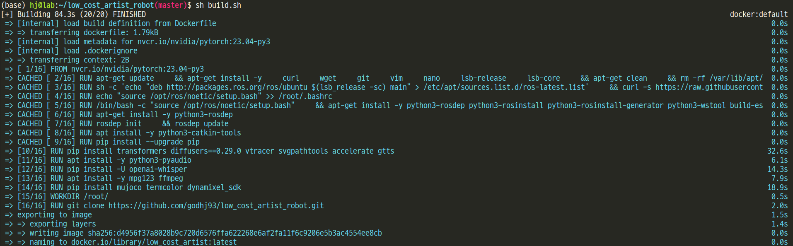
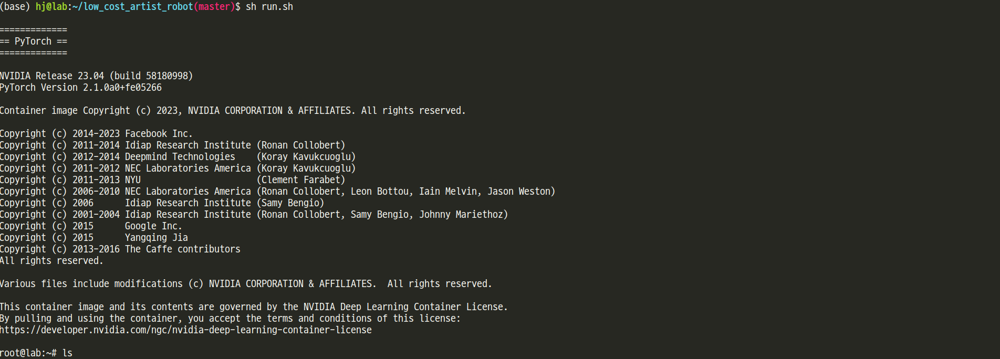
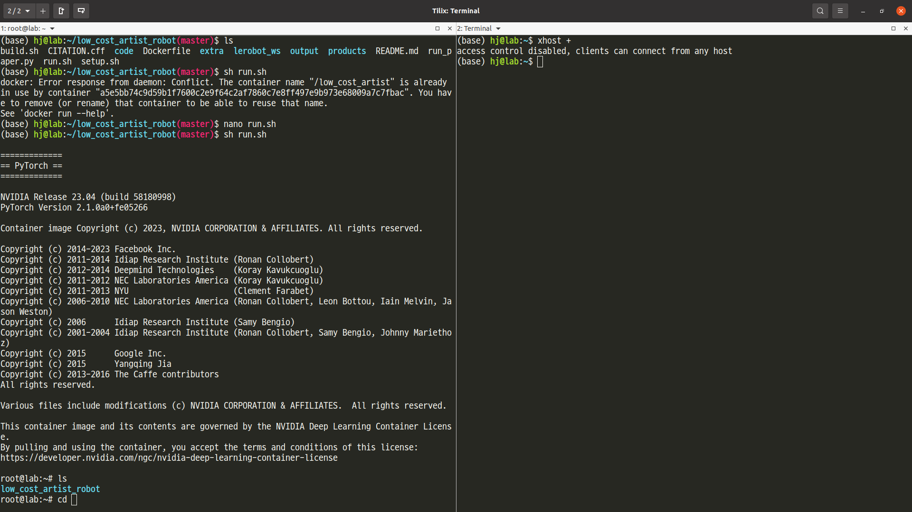
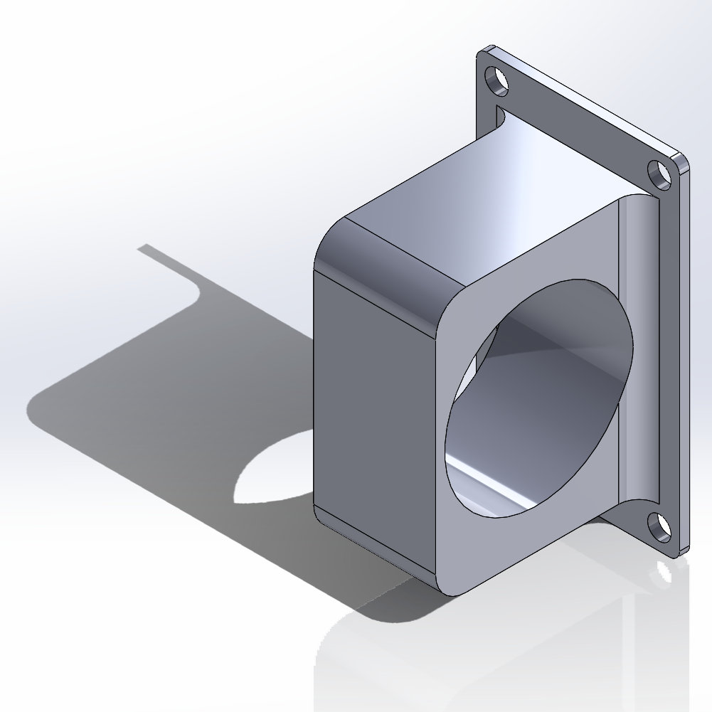
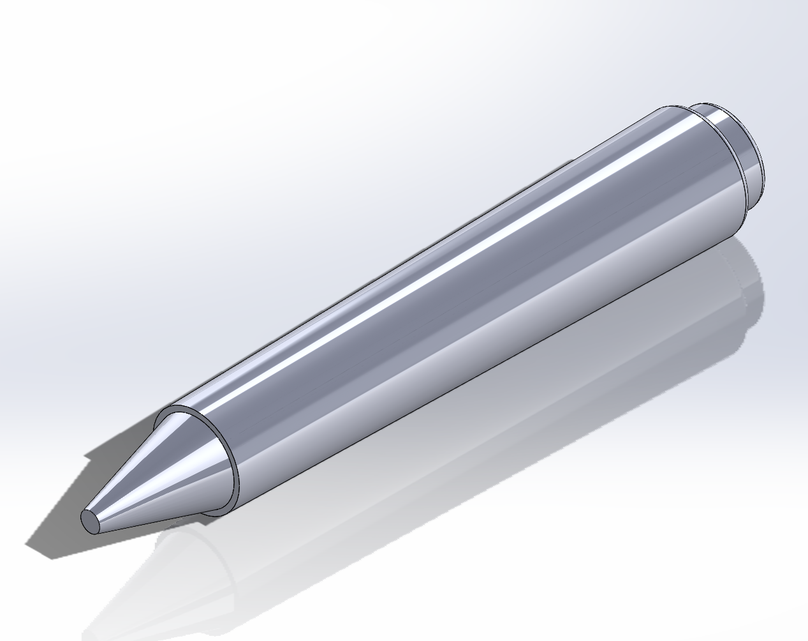
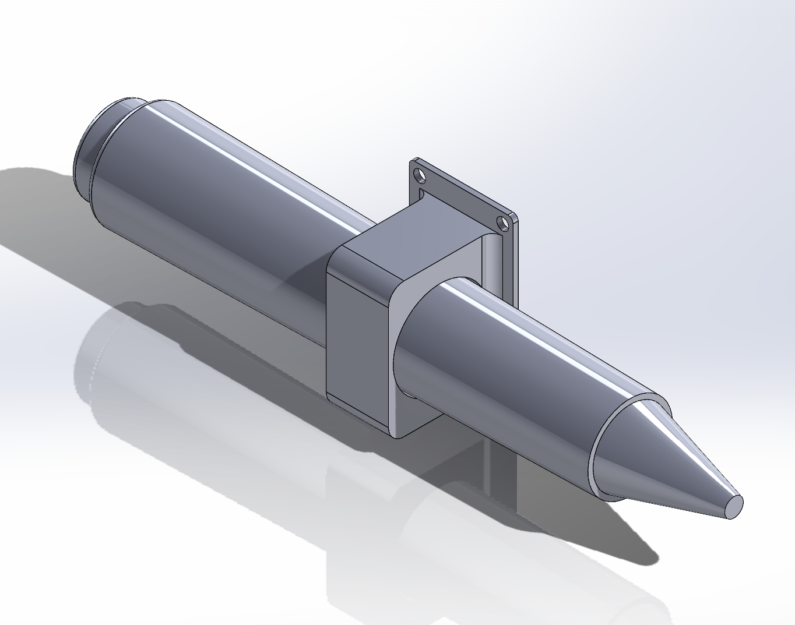

## 1. Introduction

This repository contains the code and data for the paper **"Demonstrating Artistic Drawing on Low-Cost Artist Robot"** presented at [RSS 2025](https://roboticsconference.org/). The paper discusses the development of a low-cost artist robot capable of drawing pictures on paper. The robot is built using ROS and MuJoCo and comprises a [Koch1.1](https://github.com/jess-moss/koch-v1-1) robot and a pen holder. It is controlled by a computer via ROS, enabling it to draw pictures by moving the pen holder.


[](https://youtu.be/SALlcuBjAEM)


## 2. Setup

We provide a Dockerfile to create an image with all the necessary tools to run the workflow. To build the image, run the following command:

```bash
# To build the image
sh build.sh

# To run the container
sh run.sh
```
When you successfully build the image and run the container, you will be inside the container as shown below:




Since MuJoCo is used for simulating koch1.1, we need GUI support. To run the container with GUI support, run the following command:

```bash
# In another terminal, run the following command
xhost +
```



When you successfully run the container, you can access ROS workspace as follows:

```bash
# To move to the workspace
cd ~/low_cost_artist_robot/lerobot_ws/

# build source code
catkin build

# source the workspace
source devel/setup.bash
```

To run the simulation, run the following command:

```bash
# To fix link error to use CUDA, run the following command
ldconfig
# To run the low cost artist robot in the simulation
roslaunch lerobot simulation.launch
```

- You can see the drawing result via RViz in real-time

## Additional features
We augmented [Whisper](https://openai.com/index/whisper/) model which can listen to the user's voice and convert it to text. If you have a microphone, you can use this feature!

By default, we disabled this feature. To enable this feature, you can change the script as follows:

```python3
# In the "low_cost_artist_robot/lerobot_ws/src/lerobot/scripts/drawing_client.py"
# Change the value of "MIC" to True (Line 22)
MIC = True
```

## 3. Real Robot Configuration

We adopted the Koch1.1 robot as the base robot for our low-cost artist robot. The Koch1.1 robot is a 6-DOF robot arm with a 3D-printed structure and Dynamixel XL-330 and XL-430 actuators. The assembly of the robot is straightforward. Details on the assembly and connection of the robot to the computer are provided in the following repository: [Koch1.1](https://github.com/jess-moss/koch-v1-1). You have to see **"the follower arm"** part in the repository to assemble the robot. This [video](https://www.youtube.com/watch?v=8nQIg9BwwTk&ab_channel=HuggingFace) will help you to assemble the robot.

### Pen and Pen Holder Design

We designed a pen holder specifically for the Koch1.1 robot, enabling precise movement of a pen in the x, y, and z directions. The pen holder was modeled in SolidWorks and fabricated using 3D printing technology. It is securely mounted to the Koch1.1 robot using screws, ensuring stability during operation. In our study, we utilized four actuators to control the pen, with an additional servo included to support further development and enhanced functionality.

The 3D model of the pen holder is provided in the **3D_Models** directory. It is available in both STL and SLDPRT formats, ensuring compatibility with SolidWorks. Additionally, the directory contains a 3D model of a compatible pen, also provided in STL and SLDPRT formats, making it easy to integrate and use with SolidWorks for your projects.

<p align="center">
  
  
  
</p>

You can modify the robot description for your specific pen holder design by editing the **"low_cost_artist_robot/lerobot_ws/src/lerobot/scripts/low_cost_robot/low_cost_robot.xml"** file.

In the file, you can adjust the following parameters to match your pen holder design:
```xml
      <joint name="joint5" class="joint5"/>
                                <geom pos="-0.01 0.004 -0.01"
                                      quat="-0.5 0.5 0.5 0.5"
                                      type="mesh" name="Pen_Holder"
                                      mesh="Pen_Holder"
                                      rgba="1 1 1 1"/>
                                <geom pos="-0.0035 0.025 0.05"
                                      quat="0 1 0 0"
                                      type="mesh" name="Pen"
                                      mesh="Pen"
                                      rgba="0.5 0.5 0.5 1"/>
```
Here, you can adjust the position and orientation of the pen holder and pen to match your design. Additionally, The filepath must be updated to reflect the location of your STL files in the same file.

```xml
    <asset>
        <mesh file="/root/low_cost_artist_robot/lerobot_ws/src/lerobot/scripts/low_cost_robot/assets/STL/Follower_Base.stl" scale="0.001 0.001 0.001"/>
        <mesh file="/root/low_cost_artist_robot/lerobot_ws/src/lerobot/scripts/low_cost_robot/assets/STL/Follower_Shoulder_Rotation.stl" scale="0.001 0.001 0.001"/>
        <mesh file="/root/low_cost_artist_robot/lerobot_ws/src/lerobot/scripts/low_cost_robot/assets/STL/Follower_Shoulder_To_Elbow.stl" scale="0.001 0.001 0.001"/>
        <mesh file="/root/low_cost_artist_robot/lerobot_ws/src/lerobot/scripts/low_cost_robot/assets/STL/Follower_Elbow_To_Wrist_Extension.stl" scale="0.001 0.001 0.001"/>
        <mesh file="/root/low_cost_artist_robot/lerobot_ws/src/lerobot/scripts/low_cost_robot/assets/STL/Follower_Elbow_To_Wrist.stl" scale="0.001 0.001 0.001"/>
        <mesh file="/root/low_cost_artist_robot/lerobot_ws/src/lerobot/scripts/low_cost_robot/assets/STL/Pen_Holder.stl" scale="0.001 0.001 0.001"/>
        <mesh file="/root/low_cost_artist_robot/lerobot_ws/src/lerobot/scripts/low_cost_robot/assets/STL/Pen.stl" scale="0.001 0.001 0.001"/>
        <mesh file="/root/low_cost_artist_robot/lerobot_ws/src/lerobot/scripts/low_cost_robot/assets/STL/XL-330.stl" scale="0.001 0.001 0.001"/>
        <mesh file="/root/low_cost_artist_robot/lerobot_ws/src/lerobot/scripts/low_cost_robot/assets/STL/XL-430.stl" scale="0.001 0.001 0.001"/>
    </asset>
```

### Whiteboard

To simulate the drawing process on the whiteboard, you can use the **"low_cost_artist_robot/lerobot_ws/src/lerobot/scripts/low_cost_robot/scene.xml"** file. The size of the whiteboard can be adjusted by modifying the size parameter within the file. Additionally, it is essential to specify the friction parameter to ensure the simulation aligns with your specific requirements.

```xml
	
    <body name="white_board" pos="-0.05 0.2 0.01">
        <inertial pos="0 0 0" mass="0.1" diaginertia="0.00016667 0.00016667 0.00016667"/>
        <geom friction="0.2 0.01 0.001" condim="3" pos="0.08 0.15 0" size="0.2 0.2 0.001" type="box" name="white_board" rgba="1 1 1 1" priority="1"/>
    </body>

```


# 4. Recording your own drawing
When you try to record your own drawing in the simulation, you can refer the following script:

```python
# In the "low_cost_artist_robot/lerobot_ws/src/lerobot/scripts/drawing_server.py"

# Line 35-69
import enum

class Resolution(enum.Enum):
  SD = (480, 640)
  HD = (720, 1280)
  UHD = (2160, 3840)


def quartic(t: float) -> float:
  return 0 if abs(t) > 1 else (1 - t**2) ** 2


def blend_coef(t: float, duration: float, std: float) -> float:
  normalised_time = 2 * t / duration - 1
  return quartic(normalised_time / std)


def unit_smooth(normalised_time: float) -> float:
  return 1 - np.cos(normalised_time * 2 * np.pi)


def azimuth(
    time: float, duration: float, total_rotation: float, offset: float
) -> float:
  return offset + unit_smooth(time / duration) * total_rotation

res = Resolution.SD
fps = 60
duration = 1000.0
ctrl_rate = 2
ctrl_std = 0.05
total_rot = 180
blend_std = .8

# Line 110-134
## Camera
global res, fps
h, w = res.value
world.vis.global_.offheight = h
world.vis.global_.offwidth = w
renderer = mujoco.Renderer(world, height=h, width=w)

np.random.seed(12345)

# Rendering options for visual and collision geoms.
vis = mujoco.MjvOption()
vis.geomgroup[2] = True
vis.geomgroup[3] = False
coll = mujoco.MjvOption()
coll.geomgroup[2] = False
coll.geomgroup[3] = True
coll.flags[mujoco.mjtVisFlag.mjVIS_CONVEXHULL] = True

# Create a camera that will revolve around the robot.
camera = mujoco.MjvCamera()
mujoco.mjv_defaultFreeCamera(world, camera)
camera.distance = 0.5
offset = world.vis.global_.azimuth
frames = []
##

# Line 153-170
## Camera 
            
if len(frames) < data.time * fps:
	
	target_body_name = "link5"  # Object name to look at
	target_body_id = mujoco.mj_name2id(world, mujoco.mjtObj.mjOBJ_BODY, target_body_name)

	camera.lookat[:] = data.xpos[target_body_id]
	
	camera.azimuth = azimuth(data.time, duration, total_rot, offset)
	renderer.update_scene(data, camera, scene_option=vis)
	vispix = renderer.render().copy().astype(np.float32)
	renderer.update_scene(data, camera, scene_option=coll)
	collpix = renderer.render().copy().astype(np.float32)
	b = blend_coef(data.time, duration, blend_std)
	frame = (1 - b) * vispix + b * collpix
	frame = frame.astype(np.uint8)
	frames.append(frame)
```

You can modify the above script to record your own drawing in the simulation. You can adjust the resolution, frame rate, duration, and other parameters to match your specific requirements. Additionally, you can modify the camera settings to capture the drawing process from different angles and perspectives.

For the drawing result, you can use RViz to visualize the drawing process in real-time by running the following command:

```bash
rosbag record -a -O drawing_result.bag
```

You can replay the recorded bag file using the following command:

```bash
rosbag play drawing_result.bag
```
